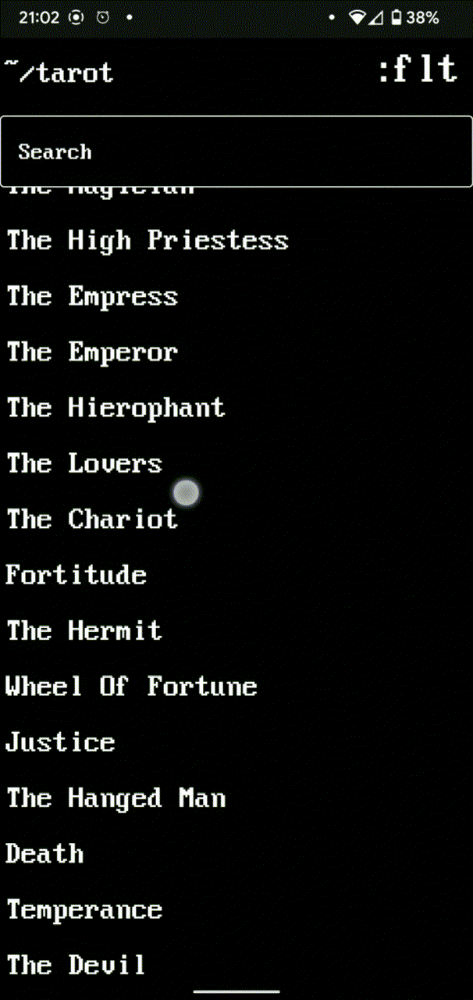
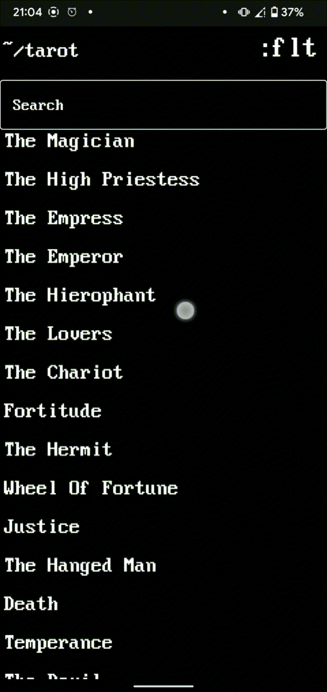

# Description
Simply app with tarot cards meaning and fancy ascii arts.
# Tech stack
- Kotlin
- Coroutines, Flow, Channel
- Orbit MVI
- Retrofit
- OkHTTP
- Room
- Jetpack Compose
- Koin
- GSON
# Features
## Card list with on-click details

## Fetching data from remote API

## Card searching and filtering

## Warning when there is no Internet connection

